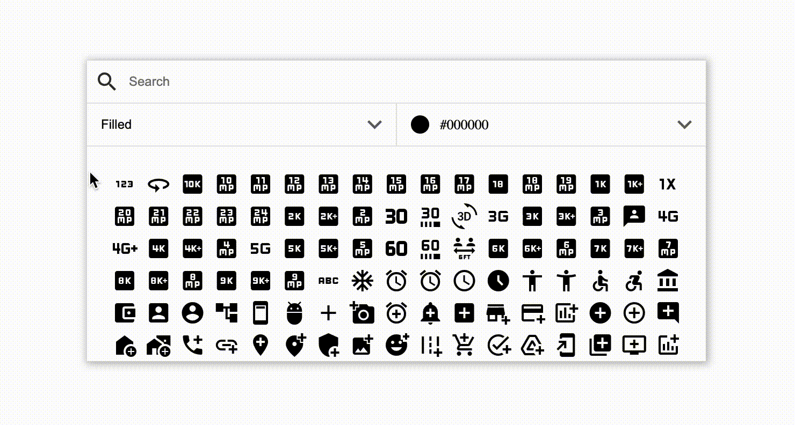

# react-material-icon-picker

[![npm package][npm-img]][npm-url]

[](https://github.com/prettier/prettier)

If you like the project, please give the project a GitHub 🌟


## Install

```bash
npm install react-material-icon-picker
```

## Usage

```ts
import { MaterialIconPicker } from 'react-material-icon-picker';

const MyComponent = () => {
    return <MaterialIconPicker />
}
```

Documentation for props will be added shortly

## Demo



[npm-img]:https://img.shields.io/npm/v/react-material-icon-picker
[npm-url]:https://www.npmjs.com/package/react-material-icon-picker

[](https://codesandbox.io/s/vigilant-glade-vj69k5?file=/src/App.jsx)


## Contributing

Your contribution is greatly appreciated! Feel free to fork the repo, make some changes, submit a pull-request! You may also submit a issue to report any bug:)

## License

MIT


[build-img]:https://github.com/ryansonshine/typescript-npm-package-template/actions/workflows/release.yml/badge.svg
[build-url]:https://github.com/ryansonshine/typescript-npm-package-template/actions/workflows/release.yml
[downloads-img]:https://img.shields.io/npm/dt/typescript-npm-package-template
[downloads-url]:https://www.npmtrends.com/typescript-npm-package-template
[issues-img]:https://img.shields.io/github/issues/ryansonshine/typescript-npm-package-template
[issues-url]:https://github.com/ryansonshine/typescript-npm-package-template/issues
[codecov-img]:https://codecov.io/gh/ryansonshine/typescript-npm-package-template/branch/main/graph/badge.svg
[codecov-url]:https://codecov.io/gh/ryansonshine/typescript-npm-package-template
[semantic-release-img]:https://img.shields.io/badge/%20%20%F0%9F%93%A6%F0%9F%9A%80-semantic--release-e10079.svg
[semantic-release-url]:https://github.com/semantic-release/semantic-release
[commitizen-img]:https://img.shields.io/badge/commitizen-friendly-brightgreen.svg
[commitizen-url]:http://commitizen.github.io/cz-cli/